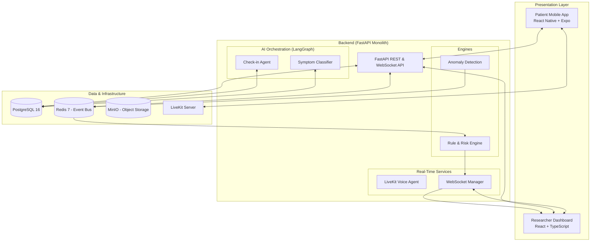

# Pulse

Pulse is an AI-powered patient safety and engagement platform designed to modernize clinical trial monitoring. It bridges the gap between scheduled clinic visits by providing continuous, intelligent oversight of participant well-being through conversational AI, wearable data integration, and real-time researcher dashboards.

## System Overview

Pulse consists of three primary integrated components:

1.  **AI Symptom Journal (Mobile App):** A React Native application where participants report symptoms through natural language conversations (text or real-time voice) driven by a protocol-aware AI agent.
2.  **Wearable Health Integration:** A passive data ingestion pipeline that collects metrics from consumer wearables and employs statistical anomaly detection to identify clinically significant deviations from a patient's personal baseline.
3.  **Researcher Safety Dashboard (Web App):** A centralized command center for clinical research coordinators (CRCs) and principal investigators (PIs) to monitor patient risk scores, triage automated alerts, and analyze cohort-level safety signals.

## High-Level Architecture

The platform is built as a modular monolith with a Python/FastAPI backend, a React web dashboard, and a React Native mobile app. It uses an event-driven internal architecture for real-time processing.



## Key Components

### 1. AI Symptom Journal
The mobile app replaces traditional paper diaries with a conversational interface. 
- **Modality:** Supports both text-based chat and low-latency voice interaction.
- **Intelligence:** Uses LangGraph to drive a stateful conversation that adapts based on the trial protocol and patient history.
- **Classification:** Automatically maps free-text descriptions to MedDRA-coded terms and CTCAE severity grades.

### 2. Wearable Integration & Anomaly Detection
The system ingests objective data (Heart Rate, SpO2, Steps, Sleep) to provide a 360-degree view of patient health.
- **Baselines:** Establishes personalized "normal" ranges for each patient during an initial enrollment period.
- **Detection:** Uses Z-score analysis for point anomalies and sliding-window linear regression for subtle trend detection.
- **Risk Scoring:** Calculates a composite risk score (0-100) factoring in symptom reports, wearable anomalies, and engagement metrics.

### 3. Researcher Dashboard
A real-time interface for clinical teams to manage safety workflows.
- **Triage:** A prioritized alert queue based on AI-generated risk scores.
- **Human-in-the-loop:** CRCs review and confirm AI symptom classifications before they enter the official trial record.
- **Analytics:** Cohort-level visualizations to detect safety signals across treatment arms.

## Technical Stack

| Category | Technologies |
| :--- | :--- |
| **Backend** | Python 3.12, FastAPI, SQLAlchemy (Async), Pydantic |
| **AI/ML** | LangChain, LangGraph, Gemini Live (via LiveKit) |
| **Frontend (Web)** | React 18, TypeScript, Tailwind CSS, Recharts, TanStack Table |
| **Frontend (Mobile)** | React Native, Expo, NativeWind, LiveKit SDK |
| **Real-Time** | LiveKit (Voice), Native WebSockets (Dashboard) |
| **Data Stores** | PostgreSQL 16, Redis 7 (Pub/Sub & Cache), MinIO (S3-compatible) |
| **Infrastructure** | Docker, Docker Compose, Nginx |

## Data Flow: Symptom Reporting to Dashboard

```mermaid
sequence_label "Patient Check-in Flow"
sequenceDiagram
    participant P as Patient (Mobile)
    participant A as AI Agent (LangGraph)
    participant DB as PostgreSQL
    participant EB as Redis (Event Bus)
    participant RE as Alert Engine
    participant WS as WebSocket Manager
    participant D as Dashboard (Web)

    P->>A: Reports symptom (Text/Voice)
    A->>A: Classify symptom (MedDRA/CTCAE)
    A->>DB: Save symptom entry
    A->>EB: Publish 'symptom.reported'
    EB->>RE: Trigger Rule Evaluation
    RE->>RE: Recalculate Risk Score
    RE->>DB: Save Alert & Risk Score
    RE->>WS: Broadcast Update
    WS->>D: Push real-time Alert/Risk update
```

## Setup and Development

Pulse is designed to run entirely in a local Docker environment for development and demonstration.

### Prerequisites
- Docker and Docker Compose
- Node.js (v20+)
- Python 3.12+
- API Keys: Google Gemini API (for LLM and Voice)

### Getting Started
1.  **Clone the repository.**
2.  **Configure Environment:** Copy `.env.example` to `.env` and provide the required API keys.
3.  **Start Services:** Run `docker compose up -d` to start the backend, database, and infrastructure.
4.  **Backend Setup:** Navigate to `backend/` and install dependencies using `uv`.
5.  **Frontend Setup:** Navigate to `apps/dashboard/` and `apps/mobile/` to install Node dependencies.

For detailed implementation notes, refer to `TECHNICAL_DOC.md` and `DESIGN_DOC.md`.
