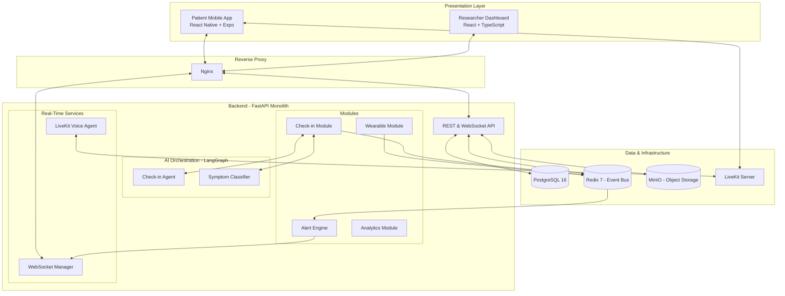
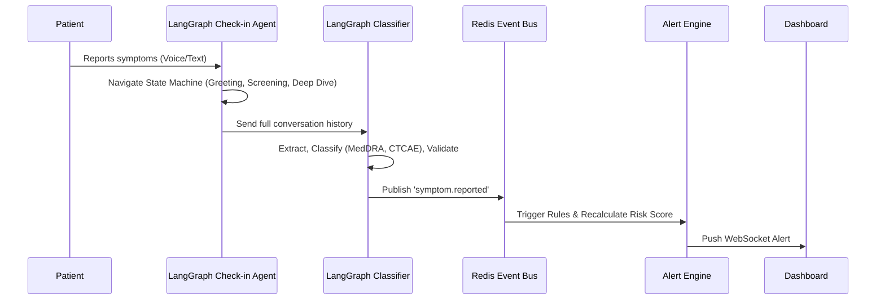

# TrialPulse

TrialPulse is an AI-powered patient safety and engagement platform designed to modernize clinical trial monitoring. It bridges the gap between scheduled clinic visits by providing continuous, intelligent oversight of participant well-being through conversational AI, wearable data integration, and real-time researcher dashboards.

## Problem Statement and Proposed Solution

Clinical trials currently suffer from delayed adverse event detection, poor patient engagement, manual data collection, and reactive safety monitoring. Patients see their clinical team infrequently, causing symptoms to go unreported until the next appointment.

TrialPulse solves this by providing continuous, intelligent patient monitoring and engagement throughout the clinical trial lifecycle. It replaces traditional paper diaries with a conversational interface, collects passive health metrics from wearable devices, and aggregates all data into a real-time web dashboard for clinical research coordinators (CRCs) and principal investigators (PIs).

## System Architecture

The platform is built as a modular monolith with a Python/FastAPI backend, a React web dashboard, and a React Native mobile app. It uses an event-driven internal architecture for real-time processing and is entirely self-contained for local deployment.



## Core Components

### 1. AI Symptom Journal (Patient Mobile App)
A React Native application providing a mobile-first conversational interface that replaces traditional paper diaries.
- **Modality:** Supports text chat and low-latency voice interaction.
- **Intelligence:** Uses LangGraph to drive a stateful conversation that adapts based on the trial protocol and patient history.
- **Classification:** Automatically maps free-text descriptions to MedDRA-coded terms and CTCAE severity grades.

### 2. Wearable Health Integration
A data ingestion pipeline that collects metrics from consumer wearables and employs statistical anomaly detection.
- **Integration:** Supports Apple HealthKit, Google Health Connect, and Fitbit Web API.
- **Baselines:** Establishes personalized normal ranges for each patient during an initial enrollment period.
- **Detection:** Uses Z-score analysis for point anomalies and sliding-window linear regression for subtle trend detection.
- **Risk Scoring:** Calculates a composite risk score factoring in symptom reports, wearable anomalies, and engagement metrics.

### 3. Researcher Safety Dashboard (Web App)
A real-time React dashboard aggregating patient-reported and wearable data into a unified view.
- **Triage:** A prioritized alert queue based on AI-generated risk scores.
- **Human-in-the-loop:** CRCs review and confirm AI symptom classifications before they enter the official trial record.
- **Analytics:** Cohort-level visualizations to detect safety signals across treatment arms.
- **Real-Time Updates:** Uses native FastAPI WebSockets to push new alerts and check-in completions instantly.

## AI and Machine Learning Pipeline

The AI/ML layer relies heavily on LangChain for vendor-agnostic LLM orchestration and LangGraph for complex, multi-step agent workflows.



### Risk Scoring Engine
Calculates a composite score from 0 to 100 based on:
- **Symptom Score (40%):** Severity grade, number of symptoms, and symptom trajectory.
- **Wearable Score (30%):** Number of flagged metrics and anomaly magnitude.
- **Engagement Score (15%):** Check-in compliance and missed sessions.
- **Compliance Score (15%):** Visit attendance and protocol adherence.

## Technical Stack

| Category | Technologies |
| :--- | :--- |
| **Backend** | Python 3.12, FastAPI, SQLAlchemy (Async), Pydantic |
| **AI/ML** | LangChain, LangGraph, LiveKit Agents SDK |
| **Frontend (Web)** | React 18, TypeScript, Tailwind CSS, Recharts, TanStack Table |
| **Frontend (Mobile)** | React Native, Expo, NativeWind, React Native Gifted Chat |
| **Real-Time** | LiveKit (Voice), Native FastAPI WebSockets |
| **Data Stores** | PostgreSQL 16, Redis 7 (Pub/Sub & Cache), MinIO (S3-compatible) |
| **Infrastructure** | Docker, Docker Compose, Nginx |

## Database Design Overview

The PostgreSQL database maintains a normalized schema for trial protocols, patient enrollments, and check-in sessions. Time-series wearable data is stored via timestamped rows with JSONB payloads to keep the stack simple without requiring a dedicated time-series database. Redis acts as the primary event bus (pub/sub), caching layer, and session store. MinIO handles object storage for voice recordings and exported reports.

## Setup and Development

Pulse is designed to run entirely in a local Docker environment for development and demonstration purposes. No external cloud infrastructure is required except for the LLM API and optionally a STT API like Deepgram.

### Prerequisites
- Docker and Docker Compose
- Node.js (v20+)
- Python 3.12+ (if running scripts outside Docker)
- Expo CLI (`npm install -g expo-cli`)
- API Keys: 
  - LLM Provider (Anthropic, OpenAI, or local via Ollama)
  - Deepgram (for Voice STT)

### Getting Started

1. **Clone the repository.**
2. **Configure Environment:** 
   Copy `.env.example` to `.env` and provide the required API keys.
   ```bash
   cp .env.example .env
   # Edit .env: set LLM_API_KEY, LLM_PROVIDER, DEEPGRAM_API_KEY
   ```
3. **Start Services:** 
   Run Docker Compose to start the backend, database, MinIO, LiveKit, Redis, and Web Dashboard.
   ```bash
   docker compose up -d --build
   ```
4. **Start the Mobile App:**
   Navigate to `apps/mobile/` and install dependencies.
   ```bash
   cd apps/mobile
   npm install
   npx expo start
   ```

### Demo Data and Scenarios
The database is automatically seeded upon first boot via the `/db/seed.sql` script or Python seed scripts. The mock data includes multiple patient profiles to demonstrate healthy baselines, mild symptoms, concerning trends (such as escalating symptoms and wearable anomalies), and missed check-ins.

## Development Roadmap

- **Phase 1: Hackathon Prototype:** Local Dockerized deployment, core conversational AI, simulated wearable data, basic dashboard.
- **Phase 2: Pilot-Ready MVP:** Real wearable integration (Apple HealthKit, Google Health Connect), HIPAA-compliant cloud infrastructure, real authentication.
- **Phase 3: Clinical Validation:** Pilot studies, AI accuracy validation against physician-coded adverse events, EDC integration.
- **Phase 4: Production Scale:** 21 CFR Part 11 validation, multilingual support, advanced predictive analytics, SOC 2 Type II certification.
